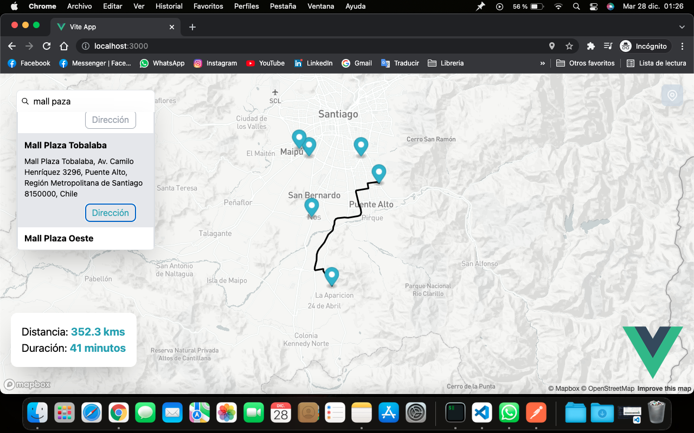

# Maps - Vue 3 + Typescript + Vite



Es un programa para ver la distancia y tiempo de un punto a otro en un mapa

- [Tailwind css](https://tailwindcss.com/)
- [Typescript](https://www.typescriptlang.org/)
- [VUE.js](https://vuejs.org/)
- [Mapbox](https://www.mapbox.com/)
- [sweetalert2](https://sweetalert2.github.io/)
- [vite](https://vitejs.dev/)

## Instalación

Template Requiere
[Node.js](https://nodejs.org/),
[NPM](https://nodejs.org/) o [yarn](https://yarnpkg.com/),
[Chrome](https://www.google.com/intl/es-419/chrome/)

Instale las dependencias y dependencias de desarrollo.

```sh
cd maps
npm i o yarn
```

.env

```sh
# token de mapbox
VITE_TOKEN_MAPBOX=
```

## Comandos

Tiene un listado de comando para realizar

| Comandos      | Descripción                                           |
| ------------- | ----------------------------------------------------- |
| npm run dev   | Crear un servidor de desarrollo                       |
| npm run build | Crear los archivos necesario para producción (./dist) |

# License

Usar este programas para aprender, no lo utilice como página para ver el clima. MIT

Free Software, Hell Yeah!
